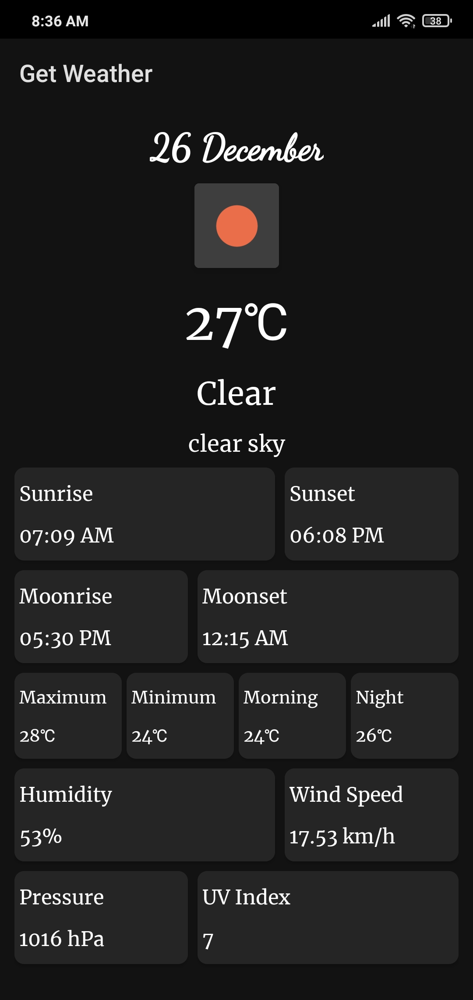

# Get-Weather-App

"Get Weather" is an android application that uses One Call API by OpenWeather. This application shows the weather of your current location. We can search the weather of another city also. It also shows the weather of next 7 days.

Concepts Implemented:- 
1. Retrofit for API call
2. MVVM Architecture
3. Search View
4. Glide for loading images
5. Dark/Night Mode theme

UI of the app:-

<h4>Splash Screen</h4>

  

<h4>Weather of current location</h4>

  

<h4>Daily Weather</h4>

  

<h4>Weather of another city</h4>

  

<h4>Dark/Night Mode</h4>

  
